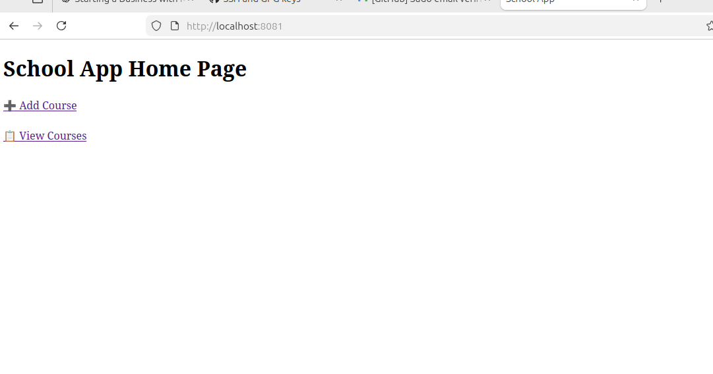
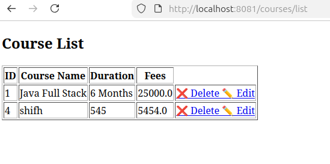

# 🎓 School Management System

A full-stack School Management System built using Spring Boot, Thymeleaf, PostgreSQL, and Bootstrap.

---

## 🚀 Features

### 📚 Course Management
- Add Course
- Edit Course
- Delete Course
- View Course List

### 👨‍🎓 Student Management
- Add Student
- Edit Student
- Delete Student
- View Student List
- Assign Students to Courses

---

## 🛠 Tech Stack

- Java 17
- Spring Boot
- Spring MVC
- Spring Data JPA
- PostgreSQL
- Thymeleaf
- Bootstrap 5
- Maven
- Git & GitHub

---


### Home Page


### Course List


### Add Student


### 🏠 Dashboard


---

### 📚 Course Management


---

## ▶️ Run Project

### Clone Repository

```bash
git clone git@github.com:shifajaman/school-management-system.git
